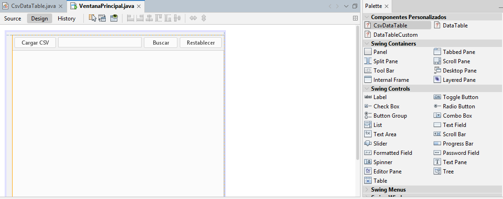
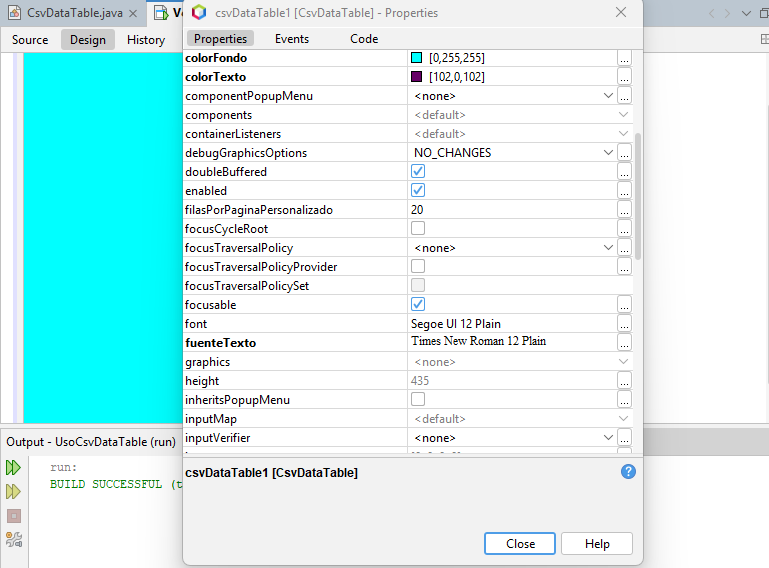
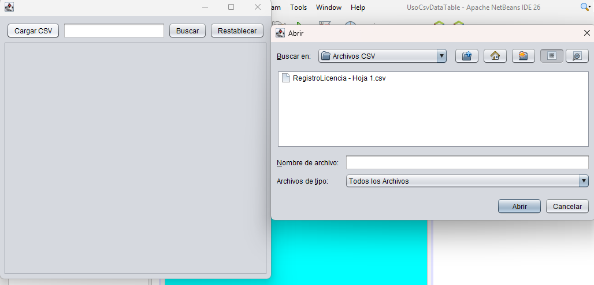
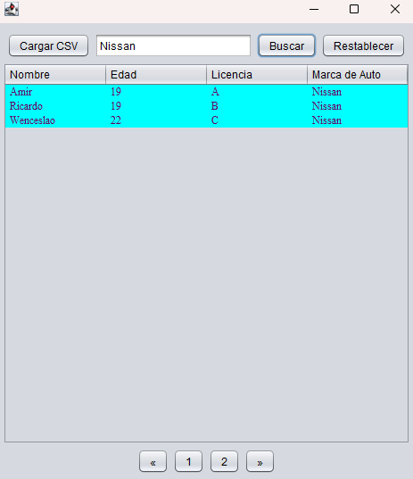
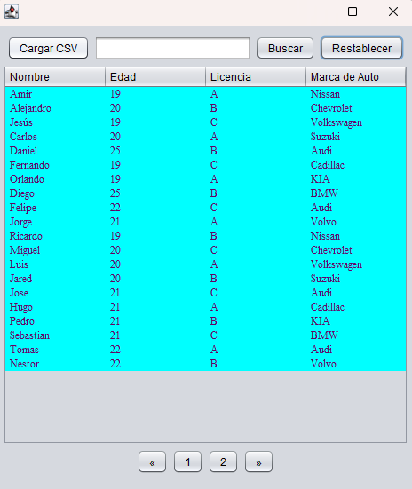
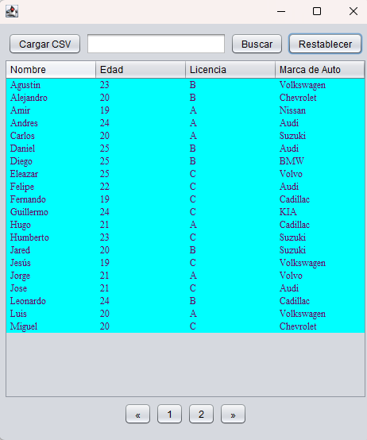

# ComponenteVisual

Descripción del componente visual:
El panel para mostrar datos en tabla (CsvDataTable) es un componente visual incluido en el paquete componente diseñado para cargar y visualizar archivos CSV dentro de una tabla interactiva con funcionalidades avanzadas como:
-  Carga de archivos CSV desde el sistema de archivos.
-  Visualización con paginación configurable.
-  Búsqueda exacta por palabra clave.
-  Ordenamiento de columnas con 3 estados: ascendente, descendente, original.
-  Botón "Restablecer" para regresar a la tabla original.
-  Personalización de fuente, colores y configuración visual desde NetBeans.

Es ideal para mostrar y explorar grandes conjuntos de datos tabulares en aplicaciones Java Swing.

# Métodos y propiedades más relevantes:

- Carga de CSV: Utiliza "JFilechooser" para seleccionar archivos ".csv" del sistema local.
private void cargarArchivoCSV(File file) {
        try (BufferedReader br = new BufferedReader(new FileReader(file))) {
            List<String[]> filas = new ArrayList<>();
            String linea;
            while ((linea = br.readLine()) != null) {
                filas.add(linea.split(",")); // Separación básica
            }
            if (!filas.isEmpty()) {
                String[] encabezados = filas.get(0);
                String[][] datos = filas.subList(1, filas.size()).toArray(new String[0][]);
                setDatos(encabezados, datos);
            } else {
                JOptionPane.showMessageDialog(this, "El archivo está vacío", "Error", JOptionPane.ERROR_MESSAGE);
            }
        } catch (IOException ex) {
            JOptionPane.showMessageDialog(this, "Error al leer el archivo: ", "Error", JOptionPane.ERROR_MESSAGE);
        }
    }

- Paginación: Opciones predefinidas (5, 10, 15, 20) o personalizada desde propiedades. 
private void calcularFilasPorPagina(){
        switch(opcionFilasPorPagina){
            case "5": filasPorPagina = 5; break;
            case "10": filasPorPagina = 10; break;
            case "15": filasPorPagina = 15; break;
            case "20": filasPorPagina = 20; break;
            case "Otro": filasPorPagina = filasPorPaginaPersonalizado; break;
            default: filasPorPagina = 20;
        }
    }

- Ordenamiento: Ciclo: ascendente, descendente, original para de nuevo ser ascendente... 
private void ordenarPorColumna(int indiceColumna){
        int estado = ordenarEstados.getOrDefault(indiceColumna, 0);
        Comparator<String[]> comparador = Comparator.comparing(row -> row[indiceColumna]);
        switch(estado){
            case 0 -> todosLosDatos.sort(comparador);
            case 1 -> todosLosDatos.sort(comparador.reversed());
            case 2 -> todosLosDatos = new ArrayList<>(datosOriginales);
        }
        ordenarEstados.put(indiceColumna, (estado + 1)%3);
        paginaActual = 0;
        actualizarPaginaTabla();
    }

# Instrucciones de uso
1. Agregar el componente: Incluye la clase "CsvDataTable" en tu proyecto dentro del paquete "componente".

2. Uso en NetBeans:
   - Registra el componente como Bean si deseas usarlo visualmente.
   - Establece las propiedades desde el panel de propiedades (por ejemplo, modoBusqueda, opcionFilasPorPagina, etc.).

     
3. Cargar archivo CSV:
   - Ejecuta la aplicación y pulsa el botón "Cargar CSV".
   - Selecciona un archivo .csv desde el explorador del sistema.

4. Buscar datos:
   - Escribe una palabra exacta en el campo de búsqueda.
   - Pulsa "Buscar" para filtrar filas que coincidan con ese valor.
   - Esta captura muestra aquellos que tienen un coche de la marca Nissan.

5. Restablecer datos:
   - Pulsa el botón "Restablecer" para volver a mostrar todos los datos cargados originalmente.
   - Se volverá activar la paginación en caso de que el archvio .csv tenga más de 20 filas o personalizado.

6. Ordenar por columnas:
   - Haz clic sobre el encabezado de cualquier columna para alternar entre orden ascendente, descendente y original.
   - En esta captura se visualiza el orden de los nombres en orden alfabético desde la A hasta la Z.

# Créditos de equipo
Este proyecto fue realizado por:
- Jarquín Rivera Orlando Miguel
- Pérez Ríos Yael Amir

Proyecto desarrollado por el Equipo 9 como parte de la asignatura Tópicos Avanzados de Programación.

Link del video de demostración de uso del componente:
https://youtu.be/g2najn-B1jU
